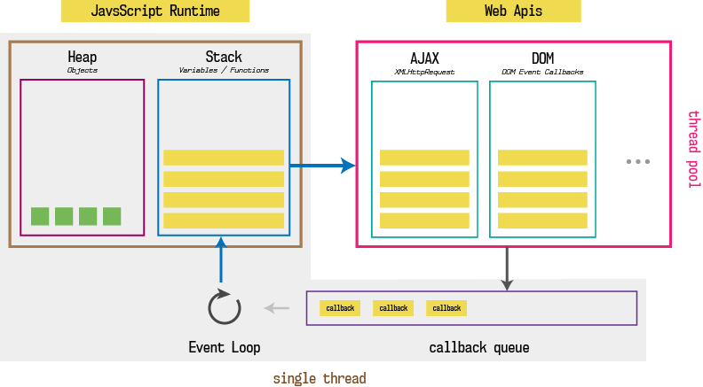
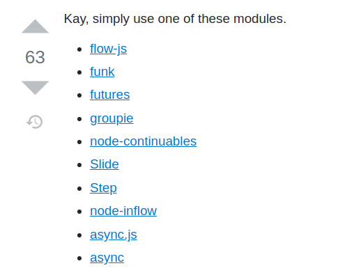

# Javascript Promises

---

<!-- Connection -->

## Is Javascript single threaded?

_open discussion_

---

<!-- Content -->

# How the Javascript event loop works

https://www.youtube.com/watch?v=8aGhZQkoFbQ

---

<!-- Concrete Practice -->

# Exercise!

### (VS LiveShare or screen share)

`https://github.com/joejag/js-promises-workshop`

_Exercises 1-3_

---

<!-- Conclusion -->



---

<!---


 PART 2


-->

<!-- Connection -->

## Are there any problems with Callbacks?

_open discussion_

---

<!-- Content -->

## Callback hell led us to the <br/> promised land

---

We want

```js
x = getData()
y = getMoreData(x)
z = getMoreData(y)
```

We get

```js
getData(function(x){
    getMoreData(x, function(y){
        getMoreData(y, function(z){
            ...
        });
    });
});
```

---

## Problems with callbacks

- The code becomes harder to read as you have to move from left to right to understand.
- Error handling is complicated and often leads to bugs.

---

## Libraries were written



#### https://stackoverflow.com/questions/4234619/how-to-avoid-long-nesting-of-asynchronous-functions-in-node-js

---

## Standardisation happened

```js
const promise = new Promise(function (resolve, reject) {
  if (Math.random() > 0.5) {
    resolve('done')
  }
  reject(new Error('bang'))
})

promise
  .then(() => console.log('woo'))
  .then(() => console.log('yay'))
  .catch(alert)
```

---

# Still problems with Promises

- Cannot use try/catch
- You need to make a `.then()` for every promise
- Looping over a list of promises is challenging

---

# Async to the rescue

- Syntactical sugar on top of promises
- No more chaining and now reads like synchronous code

---

# Promise version

```js
function printAll () {
  printString('A')
    .then(() => printString('B'))
    .then(() => printString('C'))
}
printAll()
```

---

# Async to the rescue

```js
async function printAll () {
  await printString('A')
  await printString('B')
  await printString('C')
}
printAll()
```

---

<!-- Concrete Practice -->

# Exercise!

Exercises 4-7

---

<!-- Conclusion -->

## Activity: Explain a topic

- How the event loop works in Javascript
- Why you want to use Async/Await over Promises or callbacks

---

# Aborting and generators
